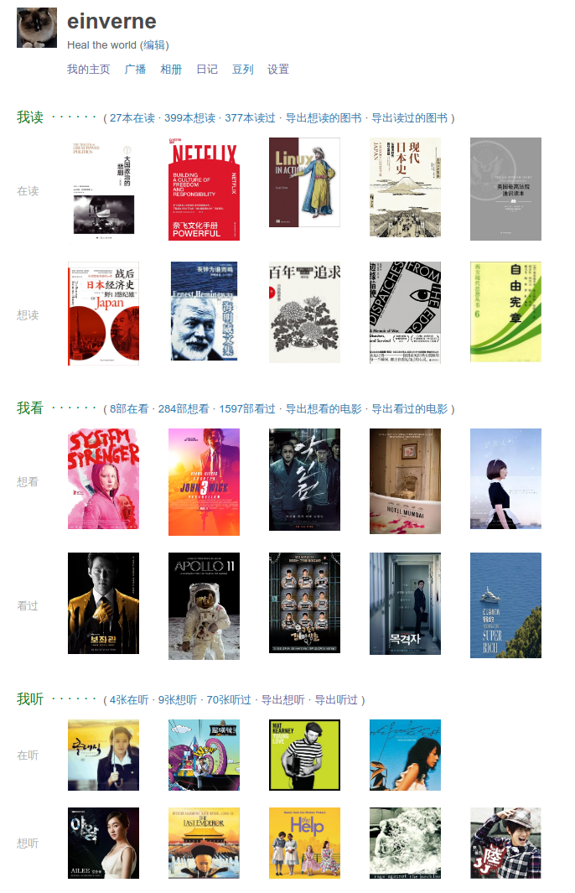
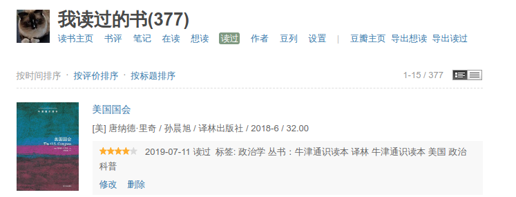
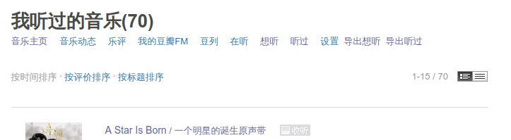

# 导出豆瓣数据

在豆瓣用户页面对应的模块中导出

豆瓣读书导出

豆瓣音乐导出

豆瓣电影导出

## reference
感谢如下两个实现

OpenUserJS

- <https://openuserjs.org/scripts/KiseXu/%E8%B1%86%E7%93%A3%E7%94%B5%E5%BD%B1%E5%AF%BC%E5%87%BA%E5%B7%A5%E5%85%B7/source>

DannyVim

- https://raw.githubusercontent.com/DannyVim/ToolsCollection/master/douban_book.js

